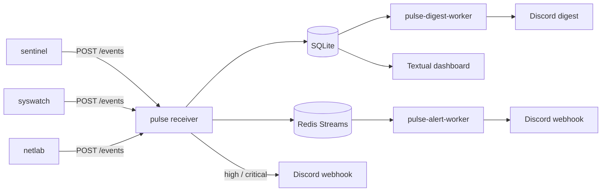

# PULSE Platform

PULSE is a single-host security event platform. It receives events from local tools, stores them in SQLite, fans them out through Redis, sends Discord alerts for high-priority signals, and presents everything in a terminal dashboard.

It is built to run on one Linux machine with low operational overhead. The stack is small on purpose: one HTTP receiver, one database, one event stream, a pair of background workers, and a Textual dashboard for live visibility.

## What It Solves

When sentinel, syswatch, and netlab are all producing useful data, the problem is not collection. The problem is correlation. PULSE gives you one place to land those events so you can see what happened, what is happening now, and what needs attention.

## How It Works



The receiver validates incoming events, deduplicates by `event_id` when provided, writes them to SQLite, and publishes them to a Redis stream named `pulse:events:<source>`. High and critical events can trigger Discord immediately. A retention job removes old rows when `PULSE_RETENTION_DAYS` is enabled.

The alert worker listens to the sentinel Redis stream and applies alert rules from `config/alert_rules.yml`. The digest worker reads the last 24 hours of database activity and sends a scheduled summary. The dashboard reads the database in read-only mode and keeps the terminal view fresh with recent totals, severity breakdowns, source breakdowns, and source-specific tabs.

## Key Components

- [receiver/app.py](receiver/app.py) exposes `GET /health` and `POST /events`.
- [receiver/storage.py](receiver/storage.py) owns SQLite persistence, deduplication, and Redis stream fan-out.
- [receiver/alerting.py](receiver/alerting.py) sends immediate Discord webhooks for high-priority events.
- [workers/alert_worker.py](workers/alert_worker.py) processes sentinel stream events and applies throttled alert rules.
- [workers/digest_worker.py](workers/digest_worker.py) builds the scheduled 24-hour digest.
- [dashboard/pulse_dashboard/app.py](dashboard/pulse_dashboard/app.py) renders the Textual interface.
- [systemd/](systemd) contains unit files for launching the stack and sensor services.
- [tmux/launch-pulse-ops.sh](tmux/launch-pulse-ops.sh) opens a tmux session with the dashboard and live service logs.

## Event Contract

The receiver accepts a single event object or a JSON array of events. Each event is expected to include:

- `schema_version`
- `timestamp`
- `source`
- `event_type`
- `severity`
- `payload`

Optional fields include `source_version`, `host`, and `event_id`.

Supported sources are `sentinel`, `netlab`, and `syswatch`. Other sources are accepted with a warning, but the project is designed around those three.

Severity values are `info`, `low`, `medium`, `high`, and `critical`.

## Repository Layout

- `receiver/` HTTP ingestion, storage, and immediate alerting.
- `workers/` background workers for alerts and digests.
- `dashboard/` the Textual TUI and its read-only query layer.
- `config/` alerting rules and runtime configuration files.
- `systemd/` service units and environment files for host-level startup.
- `tmux/` terminal workflow helpers for local operations.
- `tests/` receiver smoke and unit tests.

## Getting Started

### Prerequisites

- Python 3.11+
- Docker with Compose v2
- SQLite3 command line tools

### Local Setup

```bash
cp .env.example .env
make up
```

`make up` initializes the SQLite database if needed and starts the receiver, Redis, and workers through Docker Compose.

### View the Dashboard

```bash
make dashboard
```

The dashboard uses the local SQLite database and refreshes automatically every few seconds. Keyboard shortcuts are `q` to quit, `r` to refresh, and `1-4` to switch tabs.

### Send Events

Post events to the receiver endpoint defined in `.env` and `.env.example`, typically:

```text
POST http://127.0.0.1:8765/events
```

Set `PULSE_RECEIVER_TOKEN` if you want bearer-token protection on the receiver.

## Common Commands

- `make up` start the full stack.
- `make down` stop the stack without deleting volumes.
- `make logs` tail service logs.
- `make smoke` run the end-to-end smoke test.
- `make test` run receiver tests.
- `make clean` stop the stack and remove local SQLite and Redis data.

## Operational Modes

### Docker Compose

The default workflow runs the stack locally through Docker Compose. The receiver and Redis services bind to `127.0.0.1` by design.

### systemd

The `systemd/` directory includes unit files for host-level startup:

- `pulse-platform.service` starts the receiver, Redis, and workers with `docker compose up -d --build`.
- `pulse-sentinel.service` launches the sentinel sensor.
- `pulse-syswatch.service` launches the syswatch sensor.

### tmux

The tmux helper starts a `pulse-ops` session with the dashboard on one pane and live journal output for the sensors on the right. It is meant for daily local operations when you want one terminal workspace that shows both control and signal.

## Recent History

This repository has evolved from a basic receiver and dashboard into a single-host SOC-style stack. Recent work added native alert and digest workers, source-specific dashboard tabs, syswatch noise filtering, sentinel top-talker views, immediate Discord notification support, and systemd/tmux startup helpers.

## License

[See LICENSE file](./LICENSE)
